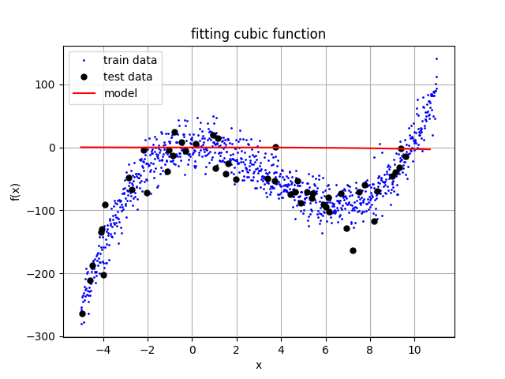

# Linear Regression
Arham Naqvi

- [Importing Required Libraries](#importing-required-libraries)
- [Generating Data](#generating-data)
- [Creating Linear Model](#creating-linear-model)
- [Stochastic Gradient Descent](#stochastic-gradient-descent)

## Importing Required Libraries

``` python
import matplotlib.pyplot as plt
import torch
device = torch.device("cuda" if torch.cuda.is_available() else "cpu")
print(f"using device: {device}")
```

    using device: cuda

## Generating Data

We begin by generating a test dataset by inserting gaussian noise to a
cubic function $f(x) = ax^{3} + bx^{2} + cx + d$. The constants $a$,
$b$, $c$ and $d$ will be chosen arbitrarily and the outputted dataset
will be saved for future model learning.

``` python
def f(x):
    return 0.7 * (x**3) - 7 * (x**2) + 1 * (x) + 5
```

``` python
X = torch.linspace(-5, 11, 1000, device=device)
Y = f(X) + 20 * torch.randn(X.shape[0], device=device)
```

``` python
plt.scatter(X.cpu(), Y.cpu(), s=2)
plt.xlabel('x')
plt.ylabel('f(x)')
plt.title('cubic function with noise and arbitrary constants')
plt.grid(True)
```

## Creating Linear Model

We now define a linear model that we will train with the generated data
in order to *learn* the arbitrarily chosen parameters in the previous
step.

Our model is a function of $x$, parameterized by weights
$a_0,\, a_1,\, a_2,\, a_3$ and will be defined as follows:

$$
\begin{equation}
    f^*(x; a_0,\, a_1,\, a_2,\, a_3) = a_0x^3 + a_1x^2 + a_2x + a_3
\end{equation}
$$

For coding convenience, we store the constants in a **numpy array:**
`a = [a0, a1, a2, a3]`.

``` python
a = torch.zeros(4, device=device)

def f_star(x):
    return a[0]*(x**3) + a[1]*(x**2) + a[2]*x + a[3]
```

The *loss function* which finds the error between our linear model’s
prediction $f^*(x)$ and the ground truth value $f(x)$ is optimizing the
parameters and is thus a function of $\mathbf{a}$ and parametersized by
$x$:

$$
\begin{equation}
    L(\mathbf{a};x) = \frac{1}{2n}\sum (f^*(x;\mathbf{a}) - f(x))^2 \tag{2}
\end{equation}
$$

``` python
def Loss(X, Y):
    return (1/2) * torch.mean((f_star(X) - Y)**2)
```

## Stochastic Gradient Descent

The *gradient* of this loss function $w.r.t$ our unkonwn weights
$\mathbf{a} = [a_0, \, a_1, \, a_2, \, a_3]$ is calculated:

$$
\begin{align*}
    \frac{d}{d\mathbf{a}} L(\mathbf{a}; x) &= \frac{d}{d\mathbf{a}} \left[ \frac{1}{2n}\sum (f^*(x;\mathbf{a}) - f(x))^2 \right] \\ \\
                      &= \frac{1}{n} \sum (f^*(x;\mathbf{a}) - f(x)) \cdot (\frac{d}{d\mathbf{a}} f^*(x;\mathbf{a})) \\ \\
                      &= \frac{1}{n} \sum (f^*(x;\mathbf{a}) - f(x)) \cdot \left[ \begin{array}{c} x^3 \\ x^2 \\ x \\ 1 \end{array} \right]
\end{align*}
$$

``` python
def gradient(X, Y):

    err = f_star(X) - Y
    X_sq = X**2
    X_cb = X_sq * X

    return torch.tensor([
        torch.mean(err * X_cb),
        torch.mean(err * X_sq),
        torch.mean(err * X),
        torch.mean(err * 1)
    ], device=device)
```

We use this gardient along with a learning rate $\alpha$ in the
**stochastic gradient descent** algorithm to *learn* the true constants
(weights).

``` python
# randomization utility function
def randomize_arrays(arrays):
    indices = torch.randperm(arrays[0].size(0), device=device)
    for arr in arrays:
        arr[:] = arr[indices]
```

``` python
samples = torch.randperm(X.size(0))

X_randomized = torch.clone(X)[samples]
Y_randomized = torch.clone(Y)[samples]

X_train = X_randomized[:int(X_randomized.size(0)*0.95)]
Y_train = Y_randomized[:int(Y_randomized.size(0)*0.95)]

X_test = X_randomized[int(X_randomized.size(0)*0.95):]
Y_test = Y_randomized[int(Y_randomized.size(0)*0.95):]

# randomize_arrays([X_train, Y_train])

lr = 0.0000005
epochs = 30000
runs = []

batch_size = int(len(X_train)*0.5)

print("Starting training...")
print(f"current weights: {a}")
print(f"true weights: {[0.7, -7, 1, 5]}")
print()

for e in range(epochs):

    randomize_arrays([X_train, Y_train])

    for batch in range(0, len(X_train), batch_size):
        
        if (batch + batch_size) > len(X_train):
            X_batch = X_train[batch:]
            Y_batch = Y_train[batch:]
        else:
            X_batch = X_train[batch:batch+batch_size]
            Y_batch = Y_train[batch:batch+batch_size]

        # compute the gradient
        grad = gradient(X_batch, Y_batch)

        # update the parameters
        a -= lr * grad
        
    if (e % 100 == 0):
        # compute the training and testing loss
        runs.append([e, a.detach().cpu(), Loss(X_train, Y_train), Loss(X_test, Y_test)])
        print(f"epoch: {e}, gradient: {torch.round(grad)}, updated weights: {torch.round(runs[-1][1])}, train loss: {torch.round(runs[-1][2])}, test loss: {torch.round(runs[-1][3])}")
        print()

    if (e % 1000 == 0) and (e != 0):
        if((runs[-10][3] - runs[-1][3]) < 0.01):
            print("convergence, stopping training")
            break
        if ((runs[-10][3] - runs[-1][3]) < 1):
            lr /= 10
```

    Starting training...
    current weights: tensor([0., 0., 0., 0.], device='cuda:0')
    true weights: [0.7, -7, 1, 5]

    epoch: 0, gradient: tensor([2818., 1120.,   62.,   48.], device='cuda:0'), updated weights: tensor([-0., -0., -0., -0.]), train loss: 3187.0, test loss: 4094.0

    epoch: 100, gradient: tensor([ 921., 1011.,   25.,   49.], device='cuda:0'), updated weights: tensor([-0., -0., -0., -0.]), train loss: 3095.0, test loss: 3898.0

    epoch: 200, gradient: tensor([1007.,  923.,   42.,   44.], device='cuda:0'), updated weights: tensor([0., -0., -0., -0.]), train loss: 3017.0, test loss: 3802.0

    epoch: 300, gradient: tensor([749., 892.,  33.,  44.], device='cuda:0'), updated weights: tensor([0., -0., -0., -0.]), train loss: 2942.0, test loss: 3709.0

    epoch: 400, gradient: tensor([-147.,  825.,   21.,   44.], device='cuda:0'), updated weights: tensor([0., -0., -0., -0.]), train loss: 2869.0, test loss: 3618.0

    epoch: 500, gradient: tensor([-842.,  738.,    6.,   42.], device='cuda:0'), updated weights: tensor([0., -0., -0., -0.]), train loss: 2798.0, test loss: 3530.0

    epoch: 600, gradient: tensor([-1583.,   779.,   -17.,    45.], device='cuda:0'), updated weights: tensor([ 0., -1., -0., -0.]), train loss: 2728.0, test loss: 3444.0

    epoch: 700, gradient: tensor([-985.,  780.,  -15.,   44.], device='cuda:0'), updated weights: tensor([ 0., -1., -0., -0.]), train loss: 2661.0, test loss: 3360.0

    epoch: 800, gradient: tensor([505., 759.,  27.,  39.], device='cuda:0'), updated weights: tensor([ 0., -1., -0., -0.]), train loss: 2595.0, test loss: 3276.0

    epoch: 900, gradient: tensor([274., 840.,  18.,  43.], device='cuda:0'), updated weights: tensor([ 0., -1., -0., -0.]), train loss: 2531.0, test loss: 3197.0

    epoch: 1000, gradient: tensor([527., 813.,  18.,  40.], device='cuda:0'), updated weights: tensor([ 0., -1., -0., -0.]), train loss: 2469.0, test loss: 3119.0

    epoch: 1100, gradient: tensor([-214.,  770.,   15.,   41.], device='cuda:0'), updated weights: tensor([ 0., -1., -0., -0.]), train loss: 2408.0, test loss: 3043.0

    epoch: 1200, gradient: tensor([-1045.,   701.,    -5.,    39.], device='cuda:0'), updated weights: tensor([ 0., -1., -0., -0.]), train loss: 2349.0, test loss: 2971.0

    epoch: 1300, gradient: tensor([158., 841.,   3.,  43.], device='cuda:0'), updated weights: tensor([ 0., -1., -0., -0.]), train loss: 2292.0, test loss: 2900.0

    epoch: 1400, gradient: tensor([1275.,  894.,   35.,   40.], device='cuda:0'), updated weights: tensor([ 0., -1., -0., -0.]), train loss: 2236.0, test loss: 2830.0

    epoch: 1500, gradient: tensor([195., 757.,  17.,  39.], device='cuda:0'), updated weights: tensor([ 0., -1., -0., -0.]), train loss: 2182.0, test loss: 2762.0

    epoch: 1600, gradient: tensor([495., 807.,  10.,  40.], device='cuda:0'), updated weights: tensor([ 0., -1., -0., -0.]), train loss: 2129.0, test loss: 2696.0

    epoch: 1700, gradient: tensor([861., 813.,  30.,  38.], device='cuda:0'), updated weights: tensor([ 0., -1., -0., -0.]), train loss: 2077.0, test loss: 2632.0

    epoch: 1800, gradient: tensor([346., 642.,  28.,  33.], device='cuda:0'), updated weights: tensor([ 0., -1., -0., -0.]), train loss: 2027.0, test loss: 2570.0

    epoch: 1900, gradient: tensor([ 96., 713.,  15.,  35.], device='cuda:0'), updated weights: tensor([ 0., -1., -0., -0.]), train loss: 1978.0, test loss: 2509.0

    epoch: 2000, gradient: tensor([-523.,  622.,    5.,   34.], device='cuda:0'), updated weights: tensor([ 0., -2., -0., -0.]), train loss: 1931.0, test loss: 2450.0

    epoch: 2100, gradient: tensor([-569.,  664.,    1.,   35.], device='cuda:0'), updated weights: tensor([ 0., -2., -0., -0.]), train loss: 1885.0, test loss: 2392.0

    epoch: 2200, gradient: tensor([1149.,  798.,   18.,   35.], device='cuda:0'), updated weights: tensor([ 0., -2., -0., -0.]), train loss: 1840.0, test loss: 2335.0

    epoch: 2300, gradient: tensor([-105.,  618.,   16.,   33.], device='cuda:0'), updated weights: tensor([ 0., -2., -0., -0.]), train loss: 1796.0, test loss: 2282.0

    epoch: 2400, gradient: tensor([-790.,  592.,   -5.,   34.], device='cuda:0'), updated weights: tensor([ 0., -2., -0., -0.]), train loss: 1753.0, test loss: 2229.0

    epoch: 2500, gradient: tensor([1327.,  813.,   18.,   36.], device='cuda:0'), updated weights: tensor([ 0., -2., -0., -0.]), train loss: 1712.0, test loss: 2177.0

    epoch: 2600, gradient: tensor([-1013.,   528.,     2.,    30.], device='cuda:0'), updated weights: tensor([ 0., -2., -0., -0.]), train loss: 1671.0, test loss: 2127.0

    epoch: 2700, gradient: tensor([929., 743.,  13.,  34.], device='cuda:0'), updated weights: tensor([ 0., -2., -0., -0.]), train loss: 1632.0, test loss: 2078.0

    epoch: 2800, gradient: tensor([-764.,  538.,    8.,   30.], device='cuda:0'), updated weights: tensor([ 0., -2., -0., -0.]), train loss: 1594.0, test loss: 2030.0

    epoch: 2900, gradient: tensor([-375.,  548.,    1.,   29.], device='cuda:0'), updated weights: tensor([ 0., -2., -0., -0.]), train loss: 1556.0, test loss: 1984.0

    epoch: 3000, gradient: tensor([506., 696.,   8.,  32.], device='cuda:0'), updated weights: tensor([ 0., -2., -0., -0.]), train loss: 1520.0, test loss: 1939.0

    epoch: 3100, gradient: tensor([-49., 541.,  10.,  29.], device='cuda:0'), updated weights: tensor([ 0., -2., -0., -0.]), train loss: 1485.0, test loss: 1895.0

    epoch: 3200, gradient: tensor([711., 610.,  25.,  30.], device='cuda:0'), updated weights: tensor([ 0., -2., -0., -0.]), train loss: 1450.0, test loss: 1853.0

    epoch: 3300, gradient: tensor([-1344.,   452.,   -11.,    29.], device='cuda:0'), updated weights: tensor([ 0., -2., -0., -0.]), train loss: 1417.0, test loss: 1811.0

    epoch: 3400, gradient: tensor([-330.,  544.,    6.,   29.], device='cuda:0'), updated weights: tensor([ 0., -2., -0., -0.]), train loss: 1384.0, test loss: 1770.0

    epoch: 3500, gradient: tensor([487., 578.,  23.,  27.], device='cuda:0'), updated weights: tensor([ 0., -2., -0., -0.]), train loss: 1353.0, test loss: 1731.0

    epoch: 3600, gradient: tensor([-1375.,   405.,   -10.,    27.], device='cuda:0'), updated weights: tensor([ 0., -3., -0., -0.]), train loss: 1322.0, test loss: 1693.0

    epoch: 3700, gradient: tensor([-806.,  455.,   -1.,   28.], device='cuda:0'), updated weights: tensor([ 0., -3., -0., -0.]), train loss: 1292.0, test loss: 1656.0

    epoch: 3800, gradient: tensor([-1082.,   433.,    -2.,    26.], device='cuda:0'), updated weights: tensor([ 0., -3., -0., -0.]), train loss: 1263.0, test loss: 1620.0

    epoch: 3900, gradient: tensor([-124.,  521.,    8.,   26.], device='cuda:0'), updated weights: tensor([ 0., -3., -0., -0.]), train loss: 1234.0, test loss: 1584.0

    epoch: 4000, gradient: tensor([672., 562.,  18.,  26.], device='cuda:0'), updated weights: tensor([ 0., -3., -0., -0.]), train loss: 1207.0, test loss: 1550.0

    epoch: 4100, gradient: tensor([-376.,  477.,    7.,   25.], device='cuda:0'), updated weights: tensor([ 0., -3., -0., -0.]), train loss: 1180.0, test loss: 1516.0

    epoch: 4200, gradient: tensor([ 99., 556.,   6.,  28.], device='cuda:0'), updated weights: tensor([ 0., -3., -0., -0.]), train loss: 1153.0, test loss: 1484.0

    epoch: 4300, gradient: tensor([-108.,  502.,    6.,   26.], device='cuda:0'), updated weights: tensor([ 0., -3., -0., -0.]), train loss: 1128.0, test loss: 1452.0

    epoch: 4400, gradient: tensor([-370.,  433.,    3.,   24.], device='cuda:0'), updated weights: tensor([ 0., -3., -0., -0.]), train loss: 1103.0, test loss: 1421.0

    epoch: 4500, gradient: tensor([315., 525.,   9.,  25.], device='cuda:0'), updated weights: tensor([ 0., -3., -0., -0.]), train loss: 1079.0, test loss: 1391.0

    epoch: 4600, gradient: tensor([310., 584.,  -1.,  27.], device='cuda:0'), updated weights: tensor([ 0., -3., -0., -0.]), train loss: 1055.0, test loss: 1362.0

    epoch: 4700, gradient: tensor([216., 542.,   7.,  26.], device='cuda:0'), updated weights: tensor([ 0., -3., -0., -0.]), train loss: 1032.0, test loss: 1334.0

    epoch: 4800, gradient: tensor([ 44., 488.,  -2.,  24.], device='cuda:0'), updated weights: tensor([ 0., -3., -0., -0.]), train loss: 1010.0, test loss: 1306.0

    epoch: 4900, gradient: tensor([-46., 462.,   1.,  24.], device='cuda:0'), updated weights: tensor([ 0., -3., -0., -0.]), train loss: 988.0, test loss: 1279.0

    epoch: 5000, gradient: tensor([210., 513.,   2.,  24.], device='cuda:0'), updated weights: tensor([ 0., -3., -0., -0.]), train loss: 967.0, test loss: 1253.0

    epoch: 5100, gradient: tensor([-245.,  425.,    4.,   22.], device='cuda:0'), updated weights: tensor([ 0., -3., -0., -0.]), train loss: 947.0, test loss: 1228.0

    epoch: 5200, gradient: tensor([-907.,  336.,    1.,   21.], device='cuda:0'), updated weights: tensor([ 0., -3., -0., -0.]), train loss: 927.0, test loss: 1203.0

    epoch: 5300, gradient: tensor([226., 419.,  13.,  21.], device='cuda:0'), updated weights: tensor([ 0., -3., -0., -0.]), train loss: 907.0, test loss: 1178.0

    epoch: 5400, gradient: tensor([-594.,  391.,   -4.,   22.], device='cuda:0'), updated weights: tensor([ 0., -3., -0., -0.]), train loss: 888.0, test loss: 1155.0

    epoch: 5500, gradient: tensor([ 25., 412.,   6.,  21.], device='cuda:0'), updated weights: tensor([ 0., -3., -0., -0.]), train loss: 870.0, test loss: 1132.0

    epoch: 5600, gradient: tensor([-896.,  325.,   -7.,   20.], device='cuda:0'), updated weights: tensor([ 0., -4., -0., -0.]), train loss: 852.0, test loss: 1110.0

    epoch: 5700, gradient: tensor([-338.,  364.,    2.,   20.], device='cuda:0'), updated weights: tensor([ 0., -4., -0., -0.]), train loss: 834.0, test loss: 1089.0

    epoch: 5800, gradient: tensor([-572.,  363.,   -4.,   20.], device='cuda:0'), updated weights: tensor([ 0., -4., -0., -0.]), train loss: 817.0, test loss: 1067.0

    epoch: 5900, gradient: tensor([ 55., 422.,   6.,  20.], device='cuda:0'), updated weights: tensor([ 0., -4., -0., -0.]), train loss: 801.0, test loss: 1047.0

    epoch: 6000, gradient: tensor([167., 435.,   6.,  21.], device='cuda:0'), updated weights: tensor([ 0., -4., -0., -0.]), train loss: 785.0, test loss: 1027.0

    epoch: 6100, gradient: tensor([527., 492.,   3.,  21.], device='cuda:0'), updated weights: tensor([ 0., -4., -0., -0.]), train loss: 769.0, test loss: 1007.0

    epoch: 6200, gradient: tensor([-506.,  292.,    1.,   17.], device='cuda:0'), updated weights: tensor([ 0., -4., -0., -0.]), train loss: 754.0, test loss: 989.0

    epoch: 6300, gradient: tensor([524., 436.,  12.,  20.], device='cuda:0'), updated weights: tensor([ 0., -4., -0., -0.]), train loss: 739.0, test loss: 970.0

    epoch: 6400, gradient: tensor([-824.,  261.,   -5.,   16.], device='cuda:0'), updated weights: tensor([ 0., -4., -0., -0.]), train loss: 724.0, test loss: 952.0

    epoch: 6500, gradient: tensor([555., 460.,   2.,  20.], device='cuda:0'), updated weights: tensor([ 0., -4., -0., -0.]), train loss: 710.0, test loss: 934.0

    epoch: 6600, gradient: tensor([-221.,  370.,   -6.,   18.], device='cuda:0'), updated weights: tensor([ 0., -4., -0., -0.]), train loss: 697.0, test loss: 918.0

    epoch: 6700, gradient: tensor([-533.,  317.,   -5.,   17.], device='cuda:0'), updated weights: tensor([ 0., -4., -0., -0.]), train loss: 683.0, test loss: 901.0

    epoch: 6800, gradient: tensor([-523.,  298.,   -6.,   16.], device='cuda:0'), updated weights: tensor([ 0., -4., -0., -0.]), train loss: 670.0, test loss: 885.0

    epoch: 6900, gradient: tensor([-660.,  230.,   -1.,   14.], device='cuda:0'), updated weights: tensor([ 0., -4., -0., -0.]), train loss: 658.0, test loss: 870.0

    epoch: 7000, gradient: tensor([-73., 360.,  -2.,  17.], device='cuda:0'), updated weights: tensor([ 0., -4., -0., -0.]), train loss: 645.0, test loss: 855.0

    epoch: 7100, gradient: tensor([-782.,  272.,   -9.,   16.], device='cuda:0'), updated weights: tensor([ 0., -4., -0., -0.]), train loss: 633.0, test loss: 840.0

    epoch: 7200, gradient: tensor([-404.,  331.,  -11.,   17.], device='cuda:0'), updated weights: tensor([ 0., -4., -0., -0.]), train loss: 622.0, test loss: 825.0

    epoch: 7300, gradient: tensor([359., 383.,  10.,  17.], device='cuda:0'), updated weights: tensor([ 0., -4., -0., -0.]), train loss: 610.0, test loss: 811.0

    epoch: 7400, gradient: tensor([223., 325.,   9.,  16.], device='cuda:0'), updated weights: tensor([ 0., -4., -0., -0.]), train loss: 599.0, test loss: 798.0

    epoch: 7500, gradient: tensor([-559.,  284.,   -6.,   16.], device='cuda:0'), updated weights: tensor([ 0., -4., -0., -0.]), train loss: 588.0, test loss: 784.0

    epoch: 7600, gradient: tensor([-709.,  234.,   -6.,   14.], device='cuda:0'), updated weights: tensor([ 0., -4., -0., -0.]), train loss: 578.0, test loss: 771.0

    epoch: 7700, gradient: tensor([-69., 324.,   1.,  16.], device='cuda:0'), updated weights: tensor([ 0., -4., -0., -0.]), train loss: 568.0, test loss: 759.0

    epoch: 7800, gradient: tensor([-847.,  222.,  -10.,   14.], device='cuda:0'), updated weights: tensor([ 0., -4., -0., -0.]), train loss: 558.0, test loss: 747.0

    epoch: 7900, gradient: tensor([816., 441.,   5.,  18.], device='cuda:0'), updated weights: tensor([ 0., -4., -0., -0.]), train loss: 548.0, test loss: 735.0

    epoch: 8000, gradient: tensor([805., 365.,  13.,  14.], device='cuda:0'), updated weights: tensor([ 0., -4., -0., -0.]), train loss: 539.0, test loss: 723.0

    epoch: 8100, gradient: tensor([416., 321.,   8.,  13.], device='cuda:0'), updated weights: tensor([ 0., -4., -0., -0.]), train loss: 530.0, test loss: 712.0

    epoch: 8200, gradient: tensor([-123.,  298.,   -1.,   14.], device='cuda:0'), updated weights: tensor([ 0., -4., -0., -0.]), train loss: 521.0, test loss: 701.0

    epoch: 8300, gradient: tensor([181., 305.,   0.,  14.], device='cuda:0'), updated weights: tensor([ 0., -4., -0., -0.]), train loss: 512.0, test loss: 690.0

    epoch: 8400, gradient: tensor([756., 402.,   7.,  15.], device='cuda:0'), updated weights: tensor([ 0., -4., -0., -0.]), train loss: 504.0, test loss: 680.0

    epoch: 8500, gradient: tensor([1054.,  370.,   12.,   13.], device='cuda:0'), updated weights: tensor([ 0., -5., -0., -0.]), train loss: 495.0, test loss: 670.0

    epoch: 8600, gradient: tensor([131., 298.,   3.,  14.], device='cuda:0'), updated weights: tensor([ 0., -5., -0., -0.]), train loss: 487.0, test loss: 660.0

    epoch: 8700, gradient: tensor([-538.,  228.,   -6.,   13.], device='cuda:0'), updated weights: tensor([ 0., -5., -0., -0.]), train loss: 480.0, test loss: 650.0

    epoch: 8800, gradient: tensor([ 96., 275.,   4.,  12.], device='cuda:0'), updated weights: tensor([ 0., -5., -0., -0.]), train loss: 472.0, test loss: 641.0

    epoch: 8900, gradient: tensor([-66., 267.,  -1.,  13.], device='cuda:0'), updated weights: tensor([ 0., -5., -0., -0.]), train loss: 465.0, test loss: 632.0

    epoch: 9000, gradient: tensor([-227.,  283.,   -9.,   14.], device='cuda:0'), updated weights: tensor([ 0., -5., -0., -0.]), train loss: 458.0, test loss: 623.0

    epoch: 9100, gradient: tensor([170., 283.,   0.,  12.], device='cuda:0'), updated weights: tensor([ 0., -5., -0., -0.]), train loss: 451.0, test loss: 615.0

    epoch: 9200, gradient: tensor([-232.,  251.,   -1.,   13.], device='cuda:0'), updated weights: tensor([ 0., -5., -0., -0.]), train loss: 444.0, test loss: 606.0

    epoch: 9300, gradient: tensor([-91., 259.,  -4.,  12.], device='cuda:0'), updated weights: tensor([ 0., -5., -0., -0.]), train loss: 437.0, test loss: 598.0

    epoch: 9400, gradient: tensor([ 29., 254.,  -3.,  12.], device='cuda:0'), updated weights: tensor([ 0., -5., -0., -0.]), train loss: 431.0, test loss: 590.0

    epoch: 9500, gradient: tensor([-244.,  233.,   -3.,   11.], device='cuda:0'), updated weights: tensor([ 0., -5., -0., -0.]), train loss: 425.0, test loss: 583.0

    epoch: 9600, gradient: tensor([1391.,  379.,   16.,   12.], device='cuda:0'), updated weights: tensor([ 0., -5., -0., -0.]), train loss: 418.0, test loss: 575.0

    epoch: 9700, gradient: tensor([347., 255.,   6.,  11.], device='cuda:0'), updated weights: tensor([ 0., -5., -0., -0.]), train loss: 412.0, test loss: 568.0

    epoch: 9800, gradient: tensor([300., 277.,   1.,  12.], device='cuda:0'), updated weights: tensor([ 0., -5., -0., -0.]), train loss: 407.0, test loss: 561.0

    epoch: 9900, gradient: tensor([-405.,  189.,   -5.,   10.], device='cuda:0'), updated weights: tensor([ 0., -5., -0., -0.]), train loss: 401.0, test loss: 554.0

    epoch: 10000, gradient: tensor([-560.,  170.,   -8.,    9.], device='cuda:0'), updated weights: tensor([ 0., -5., -0., -0.]), train loss: 396.0, test loss: 547.0

    epoch: 10100, gradient: tensor([-147.,  199.,   -4.,   10.], device='cuda:0'), updated weights: tensor([ 0., -5., -0., -0.]), train loss: 390.0, test loss: 541.0

    epoch: 10200, gradient: tensor([288., 253.,   3.,  11.], device='cuda:0'), updated weights: tensor([ 1., -5., -0., -0.]), train loss: 385.0, test loss: 534.0

    epoch: 10300, gradient: tensor([205., 247.,  -1.,  10.], device='cuda:0'), updated weights: tensor([ 1., -5., -0., -0.]), train loss: 380.0, test loss: 528.0

    epoch: 10400, gradient: tensor([593., 260.,   6.,   9.], device='cuda:0'), updated weights: tensor([ 1., -5., -0., -0.]), train loss: 375.0, test loss: 522.0

    epoch: 10500, gradient: tensor([-286.,  176.,   -4.,    9.], device='cuda:0'), updated weights: tensor([ 1., -5., -0., -0.]), train loss: 370.0, test loss: 516.0

    epoch: 10600, gradient: tensor([-156.,  227.,   -8.,   10.], device='cuda:0'), updated weights: tensor([ 1., -5., -0., -0.]), train loss: 366.0, test loss: 511.0

    epoch: 10700, gradient: tensor([-263.,  207.,  -11.,   10.], device='cuda:0'), updated weights: tensor([ 1., -5., -0., -0.]), train loss: 361.0, test loss: 505.0

    epoch: 10800, gradient: tensor([144., 217.,  -1.,   9.], device='cuda:0'), updated weights: tensor([ 1., -5., -0., -0.]), train loss: 357.0, test loss: 500.0

    epoch: 10900, gradient: tensor([216., 207.,   6.,   9.], device='cuda:0'), updated weights: tensor([ 1., -5., -0., -0.]), train loss: 352.0, test loss: 494.0

    epoch: 11000, gradient: tensor([-447.,  166.,   -8.,    9.], device='cuda:0'), updated weights: tensor([ 1., -5., -0., -0.]), train loss: 348.0, test loss: 489.0

    epoch: 11100, gradient: tensor([264., 214.,  -0.,   9.], device='cuda:0'), updated weights: tensor([ 1., -5., -0., -0.]), train loss: 344.0, test loss: 484.0

    epoch: 11200, gradient: tensor([285., 216.,   3.,   8.], device='cuda:0'), updated weights: tensor([ 1., -5., -0., -0.]), train loss: 340.0, test loss: 479.0

    epoch: 11300, gradient: tensor([121., 203.,  -3.,   9.], device='cuda:0'), updated weights: tensor([ 1., -5., -0., -0.]), train loss: 336.0, test loss: 475.0

    epoch: 11400, gradient: tensor([-700.,  146.,  -15.,    8.], device='cuda:0'), updated weights: tensor([ 1., -5., -0., -0.]), train loss: 333.0, test loss: 470.0

    epoch: 11500, gradient: tensor([-423.,  177.,  -11.,    9.], device='cuda:0'), updated weights: tensor([ 1., -5., -0., -0.]), train loss: 329.0, test loss: 466.0

    epoch: 11600, gradient: tensor([ 45., 196.,  -3.,   9.], device='cuda:0'), updated weights: tensor([ 1., -5., -0., -0.]), train loss: 325.0, test loss: 461.0

    epoch: 11700, gradient: tensor([ 38., 185.,  -4.,   7.], device='cuda:0'), updated weights: tensor([ 1., -5., -0., -0.]), train loss: 322.0, test loss: 457.0

    epoch: 11800, gradient: tensor([-361.,  143.,   -7.,    8.], device='cuda:0'), updated weights: tensor([ 1., -5., -0., -0.]), train loss: 319.0, test loss: 453.0

    epoch: 11900, gradient: tensor([278., 183.,  -2.,   7.], device='cuda:0'), updated weights: tensor([ 1., -5., -0., -0.]), train loss: 315.0, test loss: 449.0

    epoch: 12000, gradient: tensor([-430.,  137.,  -11.,    7.], device='cuda:0'), updated weights: tensor([ 1., -5., -0., -0.]), train loss: 312.0, test loss: 445.0

    epoch: 12100, gradient: tensor([ 50., 190.,  -5.,   8.], device='cuda:0'), updated weights: tensor([ 1., -5., -0., -0.]), train loss: 309.0, test loss: 442.0

    epoch: 12200, gradient: tensor([396., 193.,   1.,   8.], device='cuda:0'), updated weights: tensor([ 1., -5., -0., -0.]), train loss: 306.0, test loss: 438.0

    epoch: 12300, gradient: tensor([-194.,  153.,   -6.,    7.], device='cuda:0'), updated weights: tensor([ 1., -5., -0., -0.]), train loss: 303.0, test loss: 434.0

    epoch: 12400, gradient: tensor([-218.,  164.,  -11.,    8.], device='cuda:0'), updated weights: tensor([ 1., -5., -0., -0.]), train loss: 300.0, test loss: 431.0

    epoch: 12500, gradient: tensor([-244.,  131.,  -11.,    6.], device='cuda:0'), updated weights: tensor([ 1., -5., -0., -0.]), train loss: 297.0, test loss: 427.0

    epoch: 12600, gradient: tensor([-203.,  160.,  -10.,    7.], device='cuda:0'), updated weights: tensor([ 1., -5., -0., -0.]), train loss: 295.0, test loss: 424.0

    epoch: 12700, gradient: tensor([-105.,  162.,   -4.,    7.], device='cuda:0'), updated weights: tensor([ 1., -5., -0., -0.]), train loss: 292.0, test loss: 421.0

    epoch: 12800, gradient: tensor([-500.,   80.,   -9.,    5.], device='cuda:0'), updated weights: tensor([ 1., -5., -0., -0.]), train loss: 289.0, test loss: 418.0

    epoch: 12900, gradient: tensor([328., 179.,   3.,   6.], device='cuda:0'), updated weights: tensor([ 1., -5., -0., -0.]), train loss: 287.0, test loss: 415.0

    epoch: 13000, gradient: tensor([-208.,  136.,   -9.,    6.], device='cuda:0'), updated weights: tensor([ 1., -5., -0., -0.]), train loss: 284.0, test loss: 412.0

    epoch: 13100, gradient: tensor([254., 199.,  -3.,   7.], device='cuda:0'), updated weights: tensor([ 1., -5., -0., -0.]), train loss: 282.0, test loss: 409.0

    epoch: 13200, gradient: tensor([-392.,   97.,   -8.,    5.], device='cuda:0'), updated weights: tensor([ 1., -5., -0., -0.]), train loss: 280.0, test loss: 406.0

    epoch: 13300, gradient: tensor([166., 172.,  -1.,   6.], device='cuda:0'), updated weights: tensor([ 1., -6., -0., -0.]), train loss: 278.0, test loss: 403.0

    epoch: 13400, gradient: tensor([390., 188.,   0.,   6.], device='cuda:0'), updated weights: tensor([ 1., -6., -0., -0.]), train loss: 275.0, test loss: 401.0

    epoch: 13500, gradient: tensor([334., 198.,  -3.,   7.], device='cuda:0'), updated weights: tensor([ 1., -6., -0., -0.]), train loss: 273.0, test loss: 398.0

    epoch: 13600, gradient: tensor([-44., 138.,  -4.,   5.], device='cuda:0'), updated weights: tensor([ 1., -6., -0., -0.]), train loss: 271.0, test loss: 396.0

    epoch: 13700, gradient: tensor([-292.,  119.,   -8.,    6.], device='cuda:0'), updated weights: tensor([ 1., -6., -0., -0.]), train loss: 269.0, test loss: 393.0

    epoch: 13800, gradient: tensor([788., 203.,   8.,   6.], device='cuda:0'), updated weights: tensor([ 1., -6., -0., -0.]), train loss: 267.0, test loss: 391.0

    epoch: 13900, gradient: tensor([462., 190.,  -0.,   7.], device='cuda:0'), updated weights: tensor([ 1., -6., -0., -0.]), train loss: 265.0, test loss: 389.0

    epoch: 14000, gradient: tensor([-225.,  105.,   -6.,    5.], device='cuda:0'), updated weights: tensor([ 1., -6., -0., -0.]), train loss: 263.0, test loss: 386.0

    epoch: 14100, gradient: tensor([-906.,   27.,  -15.,    3.], device='cuda:0'), updated weights: tensor([ 1., -6., -0., -0.]), train loss: 262.0, test loss: 384.0

    epoch: 14200, gradient: tensor([-49., 122.,  -6.,   5.], device='cuda:0'), updated weights: tensor([ 1., -6., -0., -0.]), train loss: 260.0, test loss: 382.0

    epoch: 14300, gradient: tensor([-514.,   62.,  -10.,    4.], device='cuda:0'), updated weights: tensor([ 1., -6., -0., -0.]), train loss: 258.0, test loss: 380.0

    epoch: 14400, gradient: tensor([-191.,  135.,   -8.,    7.], device='cuda:0'), updated weights: tensor([ 1., -6., -0., -0.]), train loss: 256.0, test loss: 378.0

    epoch: 14500, gradient: tensor([356., 177.,  -4.,   5.], device='cuda:0'), updated weights: tensor([ 1., -6., -0., -0.]), train loss: 255.0, test loss: 376.0

    epoch: 14600, gradient: tensor([-59., 129.,  -9.,   5.], device='cuda:0'), updated weights: tensor([ 1., -6., -0., -0.]), train loss: 253.0, test loss: 374.0

    epoch: 14700, gradient: tensor([-105.,  118.,   -5.,    5.], device='cuda:0'), updated weights: tensor([ 1., -6., -0., -0.]), train loss: 252.0, test loss: 372.0

    epoch: 14800, gradient: tensor([416., 161.,   0.,   4.], device='cuda:0'), updated weights: tensor([ 1., -6., -0., -0.]), train loss: 250.0, test loss: 371.0

    epoch: 14900, gradient: tensor([ 30., 108.,  -2.,   4.], device='cuda:0'), updated weights: tensor([ 1., -6., -0., -0.]), train loss: 249.0, test loss: 369.0

    epoch: 15000, gradient: tensor([678., 186.,   2.,   5.], device='cuda:0'), updated weights: tensor([ 1., -6., -0., -0.]), train loss: 247.0, test loss: 367.0

    epoch: 15100, gradient: tensor([-182.,   89.,   -5.,    4.], device='cuda:0'), updated weights: tensor([ 1., -6., -0., -0.]), train loss: 246.0, test loss: 365.0

    epoch: 15200, gradient: tensor([ 33., 110.,  -4.,   4.], device='cuda:0'), updated weights: tensor([ 1., -6., -0., -0.]), train loss: 244.0, test loss: 364.0

    epoch: 15300, gradient: tensor([304., 143.,  -1.,   4.], device='cuda:0'), updated weights: tensor([ 1., -6., -0., -0.]), train loss: 243.0, test loss: 362.0

    epoch: 15400, gradient: tensor([-114.,  114.,   -9.,    4.], device='cuda:0'), updated weights: tensor([ 1., -6., -0., -0.]), train loss: 242.0, test loss: 361.0

    epoch: 15500, gradient: tensor([ 48., 123.,  -4.,   5.], device='cuda:0'), updated weights: tensor([ 1., -6., -0., -0.]), train loss: 241.0, test loss: 359.0

    epoch: 15600, gradient: tensor([-164.,   87.,   -9.,    3.], device='cuda:0'), updated weights: tensor([ 1., -6., -0., -0.]), train loss: 239.0, test loss: 358.0

    epoch: 15700, gradient: tensor([-333.,   70.,   -9.,    4.], device='cuda:0'), updated weights: tensor([ 1., -6., -0., -0.]), train loss: 238.0, test loss: 356.0

    epoch: 15800, gradient: tensor([171., 133.,  -3.,   4.], device='cuda:0'), updated weights: tensor([ 1., -6., -0., -0.]), train loss: 237.0, test loss: 355.0

    epoch: 15900, gradient: tensor([-334.,   77.,  -13.,    3.], device='cuda:0'), updated weights: tensor([ 1., -6., -0., -0.]), train loss: 236.0, test loss: 354.0

    epoch: 16000, gradient: tensor([-313.,   74.,  -13.,    3.], device='cuda:0'), updated weights: tensor([ 1., -6., -0., -0.]), train loss: 235.0, test loss: 352.0

    epoch: 16100, gradient: tensor([-108.,  100.,   -7.,    4.], device='cuda:0'), updated weights: tensor([ 1., -6., -0., -0.]), train loss: 234.0, test loss: 351.0

    epoch: 16200, gradient: tensor([252., 126.,  -5.,   3.], device='cuda:0'), updated weights: tensor([ 1., -6., -0., -0.]), train loss: 233.0, test loss: 350.0

    epoch: 16300, gradient: tensor([291., 128.,  -3.,   4.], device='cuda:0'), updated weights: tensor([ 1., -6., -0., -0.]), train loss: 232.0, test loss: 349.0

    epoch: 16400, gradient: tensor([159., 108.,  -6.,   3.], device='cuda:0'), updated weights: tensor([ 1., -6., -0., -0.]), train loss: 231.0, test loss: 348.0

    epoch: 16500, gradient: tensor([418., 142.,   2.,   5.], device='cuda:0'), updated weights: tensor([ 1., -6., -0., -0.]), train loss: 230.0, test loss: 346.0

    epoch: 16600, gradient: tensor([-12.,  98.,  -6.,   4.], device='cuda:0'), updated weights: tensor([ 1., -6., -0., -0.]), train loss: 229.0, test loss: 345.0

    epoch: 16700, gradient: tensor([-208.,   76.,   -7.,    3.], device='cuda:0'), updated weights: tensor([ 1., -6., -0., -0.]), train loss: 228.0, test loss: 344.0

    epoch: 16800, gradient: tensor([456., 143.,  -2.,   4.], device='cuda:0'), updated weights: tensor([ 1., -6., -0., -0.]), train loss: 227.0, test loss: 343.0

    epoch: 16900, gradient: tensor([95., 79., -6.,  2.], device='cuda:0'), updated weights: tensor([ 1., -6., -0., -0.]), train loss: 226.0, test loss: 342.0

    epoch: 17000, gradient: tensor([267., 111.,  -5.,   2.], device='cuda:0'), updated weights: tensor([ 1., -6., -0., -0.]), train loss: 225.0, test loss: 341.0

    epoch: 17100, gradient: tensor([201., 106.,  -5.,   3.], device='cuda:0'), updated weights: tensor([ 1., -6., -0., -0.]), train loss: 225.0, test loss: 340.0

    epoch: 17200, gradient: tensor([235., 117.,  -7.,   3.], device='cuda:0'), updated weights: tensor([ 1., -6., -0., -0.]), train loss: 224.0, test loss: 339.0

    epoch: 17300, gradient: tensor([13., 64., -4.,  1.], device='cuda:0'), updated weights: tensor([ 1., -6., -0., -0.]), train loss: 223.0, test loss: 339.0

    epoch: 17400, gradient: tensor([-22.,  98.,  -8.,   3.], device='cuda:0'), updated weights: tensor([ 1., -6., -0., -0.]), train loss: 222.0, test loss: 338.0

    epoch: 17500, gradient: tensor([ 72., 102.,  -7.,   3.], device='cuda:0'), updated weights: tensor([ 1., -6., -0., -0.]), train loss: 222.0, test loss: 337.0

    epoch: 17600, gradient: tensor([458., 140.,   0.,   3.], device='cuda:0'), updated weights: tensor([ 1., -6., -0., -0.]), train loss: 221.0, test loss: 336.0

    epoch: 17700, gradient: tensor([ 1., 88., -7.,  3.], device='cuda:0'), updated weights: tensor([ 1., -6., -0., -0.]), train loss: 220.0, test loss: 335.0

    epoch: 17800, gradient: tensor([-321.,   36.,  -11.,    2.], device='cuda:0'), updated weights: tensor([ 1., -6., -0., -0.]), train loss: 220.0, test loss: 335.0

    epoch: 17900, gradient: tensor([372., 105.,   1.,   2.], device='cuda:0'), updated weights: tensor([ 1., -6., -0., -0.]), train loss: 219.0, test loss: 334.0

    epoch: 18000, gradient: tensor([-244.,   44.,   -7.,    1.], device='cuda:0'), updated weights: tensor([ 1., -6., -0., -0.]), train loss: 218.0, test loss: 333.0

    epoch: 18100, gradient: tensor([-0., 66., -5.,  2.], device='cuda:0'), updated weights: tensor([ 1., -6., -0., -0.]), train loss: 218.0, test loss: 332.0

    epoch: 18200, gradient: tensor([-616.,    5.,  -14.,    1.], device='cuda:0'), updated weights: tensor([ 1., -6., -0., -0.]), train loss: 217.0, test loss: 332.0

    epoch: 18300, gradient: tensor([173., 107.,  -4.,   3.], device='cuda:0'), updated weights: tensor([ 1., -6., -0., -0.]), train loss: 216.0, test loss: 331.0

    epoch: 18400, gradient: tensor([89., 79., -7.,  2.], device='cuda:0'), updated weights: tensor([ 1., -6., -0., -0.]), train loss: 216.0, test loss: 330.0

    epoch: 18500, gradient: tensor([-270.,   37.,   -8.,    1.], device='cuda:0'), updated weights: tensor([ 1., -6., -0., -0.]), train loss: 215.0, test loss: 330.0

    epoch: 18600, gradient: tensor([228., 105.,  -6.,   2.], device='cuda:0'), updated weights: tensor([ 1., -6., -0., -0.]), train loss: 215.0, test loss: 329.0

    epoch: 18700, gradient: tensor([-146.,   49.,  -10.,    1.], device='cuda:0'), updated weights: tensor([ 1., -6., -0., -0.]), train loss: 214.0, test loss: 328.0

    epoch: 18800, gradient: tensor([-157.,   49.,   -8.,    2.], device='cuda:0'), updated weights: tensor([ 1., -6., -0., -0.]), train loss: 214.0, test loss: 328.0

    epoch: 18900, gradient: tensor([352., 128.,  -3.,   3.], device='cuda:0'), updated weights: tensor([ 1., -6., -0., -0.]), train loss: 213.0, test loss: 327.0

    epoch: 19000, gradient: tensor([-219.,   47.,   -7.,    1.], device='cuda:0'), updated weights: tensor([ 1., -6., -0., -0.]), train loss: 213.0, test loss: 327.0

    epoch: 19100, gradient: tensor([-398.,   34.,  -13.,    1.], device='cuda:0'), updated weights: tensor([ 1., -6., -0., -0.]), train loss: 212.0, test loss: 326.0

    epoch: 19200, gradient: tensor([-47.,  77.,  -8.,   2.], device='cuda:0'), updated weights: tensor([ 1., -6., -0., -0.]), train loss: 212.0, test loss: 326.0

    epoch: 19300, gradient: tensor([105.,  82.,  -8.,   2.], device='cuda:0'), updated weights: tensor([ 1., -6., -0., -0.]), train loss: 211.0, test loss: 325.0

    epoch: 19400, gradient: tensor([-56.,  65.,  -9.,   2.], device='cuda:0'), updated weights: tensor([ 1., -6., -0., -0.]), train loss: 211.0, test loss: 325.0

    epoch: 19500, gradient: tensor([130.,  74.,  -3.,   2.], device='cuda:0'), updated weights: tensor([ 1., -6., -0., -0.]), train loss: 210.0, test loss: 324.0

    epoch: 19600, gradient: tensor([100.,  90.,  -6.,   2.], device='cuda:0'), updated weights: tensor([ 1., -6., -0., -0.]), train loss: 210.0, test loss: 324.0

    epoch: 19700, gradient: tensor([453., 103.,  -3.,   2.], device='cuda:0'), updated weights: tensor([ 1., -6., -0., -0.]), train loss: 210.0, test loss: 323.0

    epoch: 19800, gradient: tensor([-49.,  48.,  -9.,   1.], device='cuda:0'), updated weights: tensor([ 1., -6., -0., -0.]), train loss: 209.0, test loss: 323.0

    epoch: 19900, gradient: tensor([249.,  79.,  -4.,   0.], device='cuda:0'), updated weights: tensor([ 1., -6., -0., -0.]), train loss: 209.0, test loss: 322.0

    epoch: 20000, gradient: tensor([41., 65., -6.,  2.], device='cuda:0'), updated weights: tensor([ 1., -6., -0., -0.]), train loss: 208.0, test loss: 322.0

    epoch: 20100, gradient: tensor([257.,  87.,  -7.,   1.], device='cuda:0'), updated weights: tensor([ 1., -6., -0., -0.]), train loss: 208.0, test loss: 321.0

    epoch: 20200, gradient: tensor([-114.,   54.,   -8.,    2.], device='cuda:0'), updated weights: tensor([ 1., -6.,  0., -0.]), train loss: 208.0, test loss: 321.0

    epoch: 20300, gradient: tensor([195.,  76.,  -5.,   2.], device='cuda:0'), updated weights: tensor([ 1., -6.,  0., -0.]), train loss: 207.0, test loss: 321.0

    epoch: 20400, gradient: tensor([-203.,   41.,   -8.,    1.], device='cuda:0'), updated weights: tensor([ 1., -6.,  0., -0.]), train loss: 207.0, test loss: 320.0

    epoch: 20500, gradient: tensor([385., 107.,  -4.,   2.], device='cuda:0'), updated weights: tensor([ 1., -6.,  0., -0.]), train loss: 207.0, test loss: 320.0

    epoch: 20600, gradient: tensor([385., 101.,  -4.,   2.], device='cuda:0'), updated weights: tensor([ 1., -6.,  0., -0.]), train loss: 206.0, test loss: 320.0

    epoch: 20700, gradient: tensor([-1167.,   -59.,   -20.,    -0.], device='cuda:0'), updated weights: tensor([ 1., -6.,  0., -0.]), train loss: 206.0, test loss: 319.0

    epoch: 20800, gradient: tensor([-795.,  -51.,  -16.,   -1.], device='cuda:0'), updated weights: tensor([ 1., -6.,  0., -0.]), train loss: 206.0, test loss: 319.0

    epoch: 20900, gradient: tensor([142.,  58.,  -4.,   0.], device='cuda:0'), updated weights: tensor([ 1., -6.,  0., -0.]), train loss: 206.0, test loss: 319.0

    epoch: 21000, gradient: tensor([274.,  80.,  -4.,   1.], device='cuda:0'), updated weights: tensor([ 1., -6.,  0., -0.]), train loss: 205.0, test loss: 318.0

    epoch: 21100, gradient: tensor([-386.,   21.,  -16.,    0.], device='cuda:0'), updated weights: tensor([ 1., -6.,  0., -0.]), train loss: 205.0, test loss: 318.0

    epoch: 21200, gradient: tensor([523., 105.,  -2.,   2.], device='cuda:0'), updated weights: tensor([ 1., -6.,  0., -0.]), train loss: 205.0, test loss: 318.0

    epoch: 21300, gradient: tensor([-437.,    9.,  -11.,    1.], device='cuda:0'), updated weights: tensor([ 1., -6.,  0., -0.]), train loss: 204.0, test loss: 317.0

    epoch: 21400, gradient: tensor([65., 56., -6.,  1.], device='cuda:0'), updated weights: tensor([ 1., -6.,  0., -0.]), train loss: 204.0, test loss: 317.0

    epoch: 21500, gradient: tensor([-540.,   -2.,  -14.,   -0.], device='cuda:0'), updated weights: tensor([ 1., -6.,  0., -0.]), train loss: 204.0, test loss: 317.0

    epoch: 21600, gradient: tensor([-56.,  48.,  -4.,   1.], device='cuda:0'), updated weights: tensor([ 1., -6.,  0., -0.]), train loss: 204.0, test loss: 317.0

    epoch: 21700, gradient: tensor([-293.,   24.,  -11.,   -0.], device='cuda:0'), updated weights: tensor([ 1., -6.,  0., -0.]), train loss: 203.0, test loss: 316.0

    epoch: 21800, gradient: tensor([794., 141.,   2.,   1.], device='cuda:0'), updated weights: tensor([ 1., -6.,  0., -0.]), train loss: 203.0, test loss: 316.0

    epoch: 21900, gradient: tensor([-207.,   23.,   -8.,    0.], device='cuda:0'), updated weights: tensor([ 1., -6.,  0., -0.]), train loss: 203.0, test loss: 316.0

    epoch: 22000, gradient: tensor([224.,  54.,  -4.,   0.], device='cuda:0'), updated weights: tensor([ 1., -6.,  0., -0.]), train loss: 203.0, test loss: 316.0

    epoch: 22100, gradient: tensor([544.,  98.,  -2.,   1.], device='cuda:0'), updated weights: tensor([ 1., -6.,  0., -0.]), train loss: 203.0, test loss: 315.0

    epoch: 22200, gradient: tensor([-41.,  63., -10.,   1.], device='cuda:0'), updated weights: tensor([ 1., -6.,  0., -0.]), train loss: 202.0, test loss: 315.0

    epoch: 22300, gradient: tensor([457.,  96.,  -4.,   2.], device='cuda:0'), updated weights: tensor([ 1., -6.,  0., -0.]), train loss: 202.0, test loss: 315.0

    epoch: 22400, gradient: tensor([260.,  75.,  -0.,   1.], device='cuda:0'), updated weights: tensor([ 1., -6.,  0., -0.]), train loss: 202.0, test loss: 315.0

    epoch: 22500, gradient: tensor([630., 112.,  -1.,   2.], device='cuda:0'), updated weights: tensor([ 1., -6.,  0., -0.]), train loss: 202.0, test loss: 314.0

    epoch: 22600, gradient: tensor([86., 54., -5.,  0.], device='cuda:0'), updated weights: tensor([ 1., -6.,  0., -0.]), train loss: 202.0, test loss: 314.0

    epoch: 22700, gradient: tensor([-180.,   24.,  -11.,    0.], device='cuda:0'), updated weights: tensor([ 1., -6.,  0., -0.]), train loss: 201.0, test loss: 314.0

    epoch: 22800, gradient: tensor([486.,  94.,  -1.,   1.], device='cuda:0'), updated weights: tensor([ 1., -6.,  0., -0.]), train loss: 201.0, test loss: 314.0

    epoch: 22900, gradient: tensor([113.,  54.,  -4.,  -0.], device='cuda:0'), updated weights: tensor([ 1., -6.,  0., -0.]), train loss: 201.0, test loss: 314.0

    epoch: 23000, gradient: tensor([-428.,   -1.,  -11.,   -0.], device='cuda:0'), updated weights: tensor([ 1., -6.,  0., -0.]), train loss: 201.0, test loss: 314.0

    epoch: 23100, gradient: tensor([179.,  61.,  -7.,   0.], device='cuda:0'), updated weights: tensor([ 1., -6.,  0., -0.]), train loss: 201.0, test loss: 313.0

    epoch: 23200, gradient: tensor([-653.,  -31.,  -17.,   -1.], device='cuda:0'), updated weights: tensor([ 1., -6.,  0., -0.]), train loss: 200.0, test loss: 313.0

    epoch: 23300, gradient: tensor([522.,  78.,  -4.,  -0.], device='cuda:0'), updated weights: tensor([ 1., -6.,  0., -0.]), train loss: 200.0, test loss: 313.0

    epoch: 23400, gradient: tensor([-8., 32., -9., -1.], device='cuda:0'), updated weights: tensor([ 1., -6.,  0., -0.]), train loss: 200.0, test loss: 313.0

    epoch: 23500, gradient: tensor([456.,  98.,  -4.,   1.], device='cuda:0'), updated weights: tensor([ 1., -6.,  0., -0.]), train loss: 200.0, test loss: 313.0

    epoch: 23600, gradient: tensor([-13.,  41.,  -8.,  -0.], device='cuda:0'), updated weights: tensor([ 1., -6.,  0., -0.]), train loss: 200.0, test loss: 313.0

    epoch: 23700, gradient: tensor([121.,  45.,  -5.,  -0.], device='cuda:0'), updated weights: tensor([ 1., -6.,  0., -0.]), train loss: 200.0, test loss: 312.0

    epoch: 23800, gradient: tensor([-156.,    7.,  -11.,   -1.], device='cuda:0'), updated weights: tensor([ 1., -6.,  0., -0.]), train loss: 200.0, test loss: 312.0

    epoch: 23900, gradient: tensor([260.,  54.,  -5.,  -1.], device='cuda:0'), updated weights: tensor([ 1., -6.,  0., -0.]), train loss: 199.0, test loss: 312.0

    epoch: 24000, gradient: tensor([527.,  94.,  -3.,   1.], device='cuda:0'), updated weights: tensor([ 1., -6.,  0., -0.]), train loss: 199.0, test loss: 312.0

    epoch: 24100, gradient: tensor([317.,  69.,  -3.,   0.], device='cuda:0'), updated weights: tensor([ 1., -6.,  0., -0.]), train loss: 199.0, test loss: 312.0

    epoch: 24200, gradient: tensor([-116.,   17.,  -11.,   -1.], device='cuda:0'), updated weights: tensor([ 1., -6.,  0., -0.]), train loss: 199.0, test loss: 312.0

    epoch: 24300, gradient: tensor([143.,  48.,  -9.,   0.], device='cuda:0'), updated weights: tensor([ 1., -6.,  0., -0.]), train loss: 199.0, test loss: 312.0

    epoch: 24400, gradient: tensor([480.,  90.,  -4.,   1.], device='cuda:0'), updated weights: tensor([ 1., -6.,  0., -0.]), train loss: 199.0, test loss: 312.0

    epoch: 24500, gradient: tensor([-228.,   14.,  -11.,   -0.], device='cuda:0'), updated weights: tensor([ 1., -6.,  0., -0.]), train loss: 199.0, test loss: 311.0

    epoch: 24600, gradient: tensor([-5., 35., -9., -0.], device='cuda:0'), updated weights: tensor([ 1., -6.,  0., -0.]), train loss: 199.0, test loss: 311.0

    epoch: 24700, gradient: tensor([646.,  95.,  -1.,   0.], device='cuda:0'), updated weights: tensor([ 1., -6.,  0., -0.]), train loss: 198.0, test loss: 311.0

    epoch: 24800, gradient: tensor([103.,  58.,  -6.,   0.], device='cuda:0'), updated weights: tensor([ 1., -6.,  0., -0.]), train loss: 198.0, test loss: 311.0

    epoch: 24900, gradient: tensor([98., 45., -8.,  0.], device='cuda:0'), updated weights: tensor([ 1., -6.,  0., -0.]), train loss: 198.0, test loss: 311.0

    epoch: 25000, gradient: tensor([-316.,   -2.,  -13.,   -1.], device='cuda:0'), updated weights: tensor([ 1., -6.,  0., -0.]), train loss: 198.0, test loss: 311.0

    epoch: 25100, gradient: tensor([-355.,   -5.,   -9.,   -1.], device='cuda:0'), updated weights: tensor([ 1., -6.,  0., -0.]), train loss: 198.0, test loss: 311.0

    epoch: 25200, gradient: tensor([-161.,   11.,  -10.,   -1.], device='cuda:0'), updated weights: tensor([ 1., -6.,  0., -0.]), train loss: 198.0, test loss: 311.0

    epoch: 25300, gradient: tensor([136.,  33.,  -7.,  -1.], device='cuda:0'), updated weights: tensor([ 1., -6.,  0., -0.]), train loss: 198.0, test loss: 311.0

    epoch: 25400, gradient: tensor([331.,  75.,  -4.,   1.], device='cuda:0'), updated weights: tensor([ 1., -6.,  0., -0.]), train loss: 198.0, test loss: 311.0

    epoch: 25500, gradient: tensor([-414.,   -6.,  -14.,   -1.], device='cuda:0'), updated weights: tensor([ 1., -6.,  0., -0.]), train loss: 198.0, test loss: 311.0

    epoch: 25600, gradient: tensor([-61.,  28., -12.,  -0.], device='cuda:0'), updated weights: tensor([ 1., -6.,  0., -0.]), train loss: 198.0, test loss: 311.0

    epoch: 25700, gradient: tensor([-72.,  28., -12.,   0.], device='cuda:0'), updated weights: tensor([ 1., -6.,  0., -0.]), train loss: 198.0, test loss: 311.0

    epoch: 25800, gradient: tensor([507.,  82.,  -2.,   0.], device='cuda:0'), updated weights: tensor([ 1., -6.,  0., -0.]), train loss: 198.0, test loss: 311.0

    epoch: 25900, gradient: tensor([ 5., 22., -7., -1.], device='cuda:0'), updated weights: tensor([ 1., -6.,  0., -0.]), train loss: 198.0, test loss: 311.0

    epoch: 26000, gradient: tensor([189.,  47.,  -6.,  -0.], device='cuda:0'), updated weights: tensor([ 1., -6.,  0., -0.]), train loss: 198.0, test loss: 311.0

    epoch: 26100, gradient: tensor([-70.,  24.,  -7.,  -1.], device='cuda:0'), updated weights: tensor([ 1., -6.,  0., -0.]), train loss: 198.0, test loss: 311.0

    epoch: 26200, gradient: tensor([26., 32., -9., -0.], device='cuda:0'), updated weights: tensor([ 1., -6.,  0., -0.]), train loss: 198.0, test loss: 311.0

    epoch: 26300, gradient: tensor([-293.,    0.,  -11.,   -1.], device='cuda:0'), updated weights: tensor([ 1., -6.,  0., -0.]), train loss: 198.0, test loss: 311.0

    epoch: 26400, gradient: tensor([-195.,   10.,  -12.,   -0.], device='cuda:0'), updated weights: tensor([ 1., -6.,  0., -0.]), train loss: 198.0, test loss: 311.0

    epoch: 26500, gradient: tensor([-113.,   26.,   -8.,   -1.], device='cuda:0'), updated weights: tensor([ 1., -6.,  0., -0.]), train loss: 198.0, test loss: 311.0

    epoch: 26600, gradient: tensor([323.,  69.,  -5.,   0.], device='cuda:0'), updated weights: tensor([ 1., -6.,  0., -0.]), train loss: 198.0, test loss: 311.0

    epoch: 26700, gradient: tensor([78., 42., -5.,  0.], device='cuda:0'), updated weights: tensor([ 1., -6.,  0., -0.]), train loss: 198.0, test loss: 311.0

    epoch: 26800, gradient: tensor([46., 43., -9., -0.], device='cuda:0'), updated weights: tensor([ 1., -6.,  0., -0.]), train loss: 198.0, test loss: 311.0

    epoch: 26900, gradient: tensor([-206.,   17.,   -9.,   -0.], device='cuda:0'), updated weights: tensor([ 1., -6.,  0., -0.]), train loss: 198.0, test loss: 311.0

    epoch: 27000, gradient: tensor([-234.,    4.,  -11.,   -1.], device='cuda:0'), updated weights: tensor([ 1., -6.,  0., -0.]), train loss: 198.0, test loss: 311.0

    convergence, stopping training

``` python
from matplotlib.animation import FuncAnimation
from matplotlib.animation import PillowWriter
```

``` python
%matplotlib widget
```

``` python
# final results

# data
fig, ax = plt.subplots()
ax.plot(X_train.cpu(), Y_train.cpu(), 'b.', markersize=2, label='train data')
ax.plot(X_test.cpu(), Y_test.cpu(), 'k.', markersize=10, label='test data')

# model
samples = torch.arange(0, len(X), len(X)//50)
X_samples = X[samples]
Y_samples = Y[samples]

line, = ax.plot([], [], 'r-', label='model')

def init():
    line.set_data([], [])
    return line,

def update(frame):
    global a
    a = runs[frame][1]
    line.set_data(X_samples.cpu(), f_star(X_samples).cpu())
    return line,

ax.set_xlabel('x')
ax.set_ylabel('f(x)')
ax.set_title('fitting cubic function')
ax.legend()
ax.grid(True)

ani = FuncAnimation(fig, update, frames=range(len(runs)), init_func=init, blit=True, interval=1000//30)

plt.close(fig)

ani.save("modelfit_animation.gif", writer=PillowWriter(fps=30))
```


